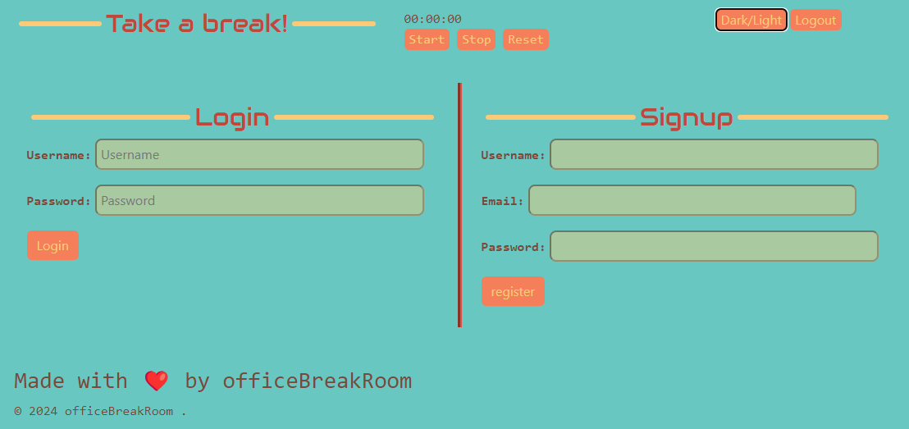
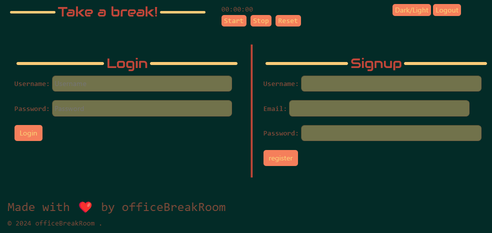
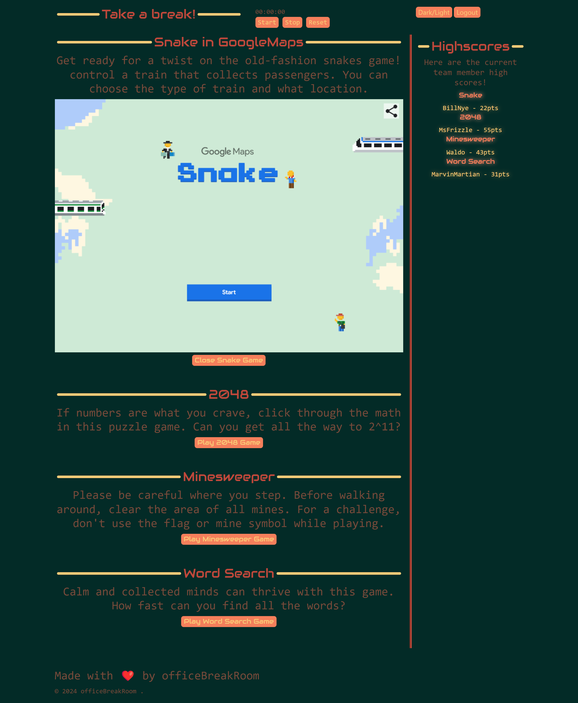

# Office_Break_Room

## Description

Some times office workers need to take a break from a day filled with constant work. This website is reminiscent of older Game Manager Websites and allows coworkers to compete against each other and themselves using high scores from different games. We wanted to create an easy way to bring games into an office for workers to have fun with their coworkers. Our idea was to create a website that has easy functionality so it's quick to access in case workers want to play a game during a short break. This website can help coworkers get to know each other and involve everyone. We learned how connect many different aspects of such a site: handlebars.js, controllers, models, routes and views.

## Table of Contents

- [Features](#features)
- [Usage](#usage)
- [Credits](#credits)
- [License](#license)

## Features

Timer - The timer allows the user to pick from an array an amount of time they'd like to use the website. This allows them to not loose track of their break and get back to work when it is time to do so.
Game Selector - this option allows the user to choose from a variety of games the one they choose to play at the time of use.
Leader Board - This board allows users to see what users have the high scores for each game and what that high score is.

## Usage

If a user is visiting the website for the first time, they will need to use the sign-up feature to gain access. If a user has used the website before, they will need to use the log-in feature to gain access each time they visit. 

If the user selects the 'Settings' button in the upper left, they will be given a dropdown menue of different setting they can change. The options include:

On the right side of the website the user will be able to view the Leaderboard. This object includes the top scores for each game.

On the main page, the user can see the listed games. When the user clicks on one of the game options, the chosen game will be displayed for the user to play.

At the top of the page toward the right side, there is a Timer function. The Timer allows the user to select a time from pre-set options. Once a time is selected, the Timer keeps track and counts down. This allows the user to not get lost in a game and loose track of time. Once the Timer reaches Zero, it will send an alert to the user that their break/game time should be over.

Deployed Link: https://office-break-room.onrender.com

 

## Credits

collaborators:
*Austin Lee, 
*Juliette Ngum,
*Matthew Prois,
*Solomiia Trachuk	

Application websites:
*Snake by GoogleMaps Game   https://snake.googlemaps.com/
*2048 Game   https://play2048.co/
*Minesweeper Game   https://minesweeper.one/
*Word Search Game   https://word-search-puzzles.appspot.com/

## License

Please refer to the LICENSE in the repo.
